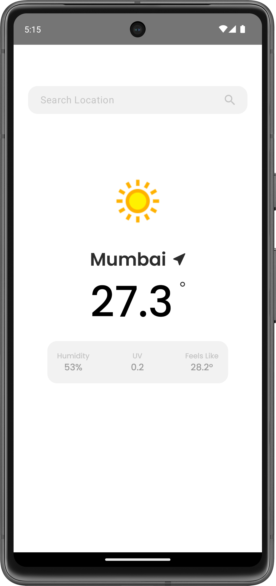
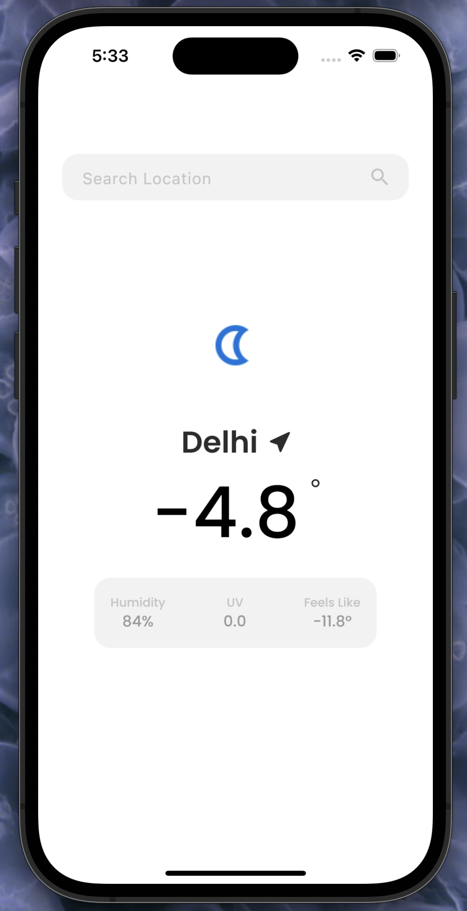
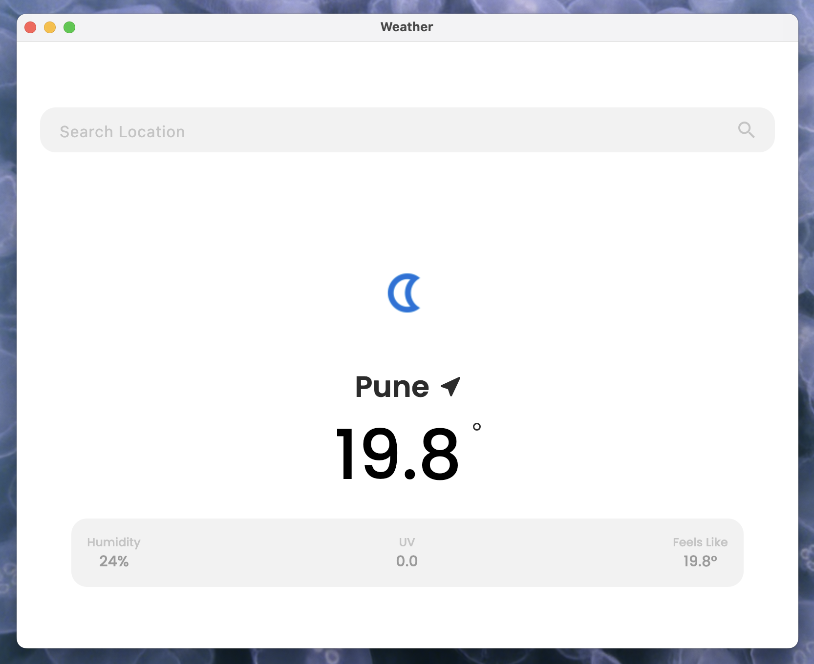
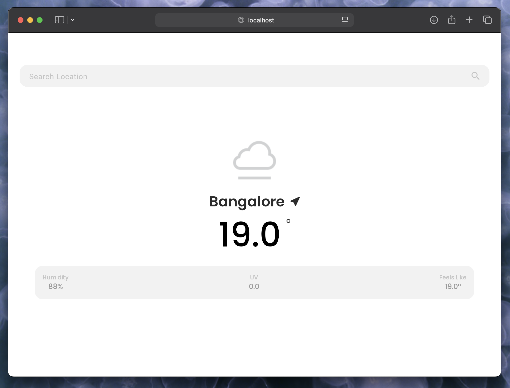

# WeatherKMP

WeatherKMP is a Kotlin Multiplatform project targeting Android, iOS, Web, Desktop, and Server. This project demonstrates the use of Kotlin Multiplatform to share code across different platforms, leveraging Compose Multiplatform for UI and Ktor for server-side development.


| Android       | iOS | Desktop | Web |
|---------------|-----|---------|-----|
|  |  |  |  |

## Project Structure
This is a Kotlin Multiplatform project targeting Android, iOS, Web, Desktop, Server.

* `/composeApp` is for code that will be shared across your Compose Multiplatform applications.
  It contains several subfolders:
  - `commonMain` is for code that’s common for all targets.
  - Other folders are for Kotlin code that will be compiled for only the platform indicated in the folder name.
    For example, if you want to use Apple’s CoreCrypto for the iOS part of your Kotlin app,
    `iosMain` would be the right folder for such calls.

* `/iosApp` contains iOS applications. Even if you’re sharing your UI with Compose Multiplatform, 
  you need this entry point for your iOS app. This is also where you should add SwiftUI code for your project.

* `/server` is for the Ktor server application.

* `/shared` is for the code that will be shared between all targets in the project.
  The most important subfolder is `commonMain`. If preferred, you can add code to the platform-specific folders here too.


Learn more about [Kotlin Multiplatform](https://www.jetbrains.com/help/kotlin-multiplatform-dev/get-started.html),
[Compose Multiplatform](https://github.com/JetBrains/compose-multiplatform/#compose-multiplatform),
[Kotlin/Wasm](https://kotl.in/wasm/)…

We would appreciate your feedback on Compose/Web and Kotlin/Wasm in the public Slack channel [#compose-web](https://slack-chats.kotlinlang.org/c/compose-web).
If you face any issues, please report them on [GitHub](https://github.com/JetBrains/compose-multiplatform/issues).

You can open the web application by running the `:composeApp:wasmJsBrowserDevelopmentRun` Gradle task.

## Getting Started

### Prerequisites

- [Kotlin](https://kotlinlang.org/)
- [Gradle](https://gradle.org/)
- [Yarn](https://yarnpkg.com/)

### Building the Project

To build the project, run the following command:

```sh
./gradlew build
```

Running the Web Application
To run the web application, execute the following Gradle task:

./gradlew :composeApp:wasmJsBrowserDevelopmentRun

Learn More
Kotlin Multiplatform
Compose Multiplatform
Kotlin/Wasm

License
This project is licensed under the MIT License - see the LICENSE file for details.
